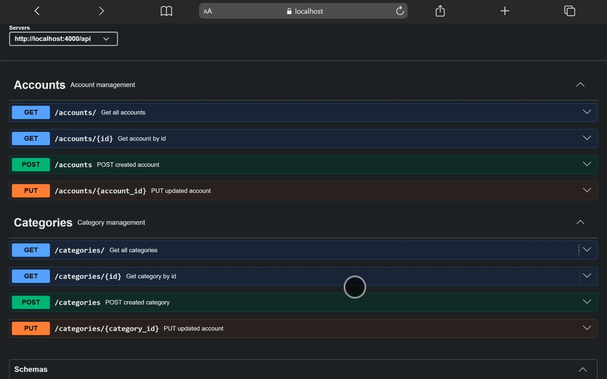

# Expense Control System - Backend API

Sistema de control de gastos personales con arquitectura modular basada en Node.js, Express y TypeScript.

## 🚀 Características

- **API REST** construida con Express.js
- **TypeScript** para tipado estático y mejor desarrollo
- **Arquitectura modular** con separación de responsabilidades
- **CORS configurado** para frontend específico
- **Validación de datos** con Zod y express-validator
- **Logging** con Morgan
- **Gestión de variables de entorno** con dotenv
- **Documentación API** con Swagger UI
- **Base de datos PostgreSQL** con conexión pool
- **Validación de entrada** robusta y tipada

## 📁 Estructura del Proyecto

```
system-backend/
├── src/
│   ├── config/           # Configuraciones (CORS, base de datos, etc.)
│   ├── database/         # Configuración y conexión a base de datos
│   ├── modules/          # Módulos de la aplicación
│   │   ├── accounts/     # Gestión de cuentas
│   │   ├── categories/   # Categorías de gastos
│   │   ├── creditCard/   # Tarjetas de crédito
│   │   ├── creditCardHistoryDetails/  # Historial de tarjetas
│   │   ├── creditCardPayment/         # Pagos de tarjetas
│   │   ├── debts/        # Deudas
│   │   ├── detailsDebts/ # Detalles de deudas
│   │   ├── motion/       # Movimientos
│   │   └── movementLimits/  # Límites de movimientos
│   ├── utils/            # Utilidades compartidas
│   ├── index.ts          # Punto de entrada
│   └── server.ts         # Configuración del servidor Express
├── dist/                 # Código compilado
├── .env                  # Variables de entorno
├── .gitignore
├── package.json
├── pnpm-lock.yaml
├── tsconfig.json
└── README.md
```

## 🛠️ Tecnologías

- **Node.js** - Runtime JavaScript
- **Express.js** - Framework web
- **TypeScript** - Superset de JavaScript
- **pnpm** - Gestor de paquetes
- **Morgan** - Middleware de logging
- **CORS** - Cross-Origin Resource Sharing
- **dotenv** - Gestión de variables de entorno
- **express-validator** - Validación de datos
- **Zod** - Validación de esquemas tipados
- **Swagger UI** - Documentación de API interactiva
- **PostgreSQL** - Base de datos relacional

## 📋 Prerrequisitos

- Node.js (versión 18 o superior)
- pnpm (recomendado) o npm
- TypeScript

## 🚀 Instalación

1. Clona el repositorio:
```bash
git clone <url-del-repositorio>
cd expense-control-system/system-backend
```

2. Instala las dependencias:
```bash
pnpm install
```

3. Configura las variables de entorno:
```bash
cp .env.example .env
# Edita .env con tus configuraciones
```

## 🔧 Variables de Entorno

Crea un archivo `.env` con las siguientes variables:

```env
PORT=4000
FRONTEND_URL=http://localhost:3000
FRONTEND_URL_PRODUCCTION=https://tu-dominio.com
# Agrega otras variables de base de datos o servicios aquí
```

## 🏃‍♂️ Ejecución

### Modo Desarrollo
```bash
# Ejecutar con nodemon y reinicio automático
pnpm run dev

# Ejecutar específicamente para API
pnpm run dev:api
```

### Modo Producción
```bash
# Compilar TypeScript
pnpm run build

# Ejecutar versión compilada
pnpm start
```

## 📚 Módulos Disponibles

### Accounts (Cuentas)
- Gestión completa de cuentas de usuario
- CRUD de cuentas con validación
- Endpoint: `/api/accounts`
- Operaciones:
  - `GET /api/accounts` - Obtener todas las cuentas
  - `GET /api/accounts/:account_id` - Obtener cuenta por ID
  - `POST /api/accounts` - Crear nueva cuenta
  - `PUT /api/accounts/:account_id` - Actualizar cuenta existente

### Categories (Categorías)
- Clasificación de gastos e ingresos
- Gestión de categorías con tipos (Ingreso/Egreso)
- Endpoint: `/api/categories`
- Operaciones:
  - `GET /api/categories` - Obtener todas las categorías
  - `GET /api/categories/:category_id` - Obtener categoría por ID
  - `POST /api/categories` - Crear nueva categoría
  - `PUT /api/categories/:category_id` - Actualizar categoría existente

### Credit Card (Tarjetas de Crédito)
- Gestión de tarjetas de crédito
- Historial de transacciones
- Gestión de pagos

### Debts (Deudas)
- Control de deudas
- Detalles y seguimiento

### Motion (Movimientos)
- Registro de transacciones
- Límites y control

## � Documentación API

La API cuenta con documentación interactiva mediante Swagger UI:

- **URL**: `http://localhost:4000/api/docs`
- **Características**:
  - Exploración interactiva de endpoints
  - Esquemas de datos detallados
  - Prueba directa desde la interfaz
  - Documentación de respuestas y errores

## Vista de la documentación


## 🔌 API Endpoints

### Accounts
- `GET /api/accounts` - Obtener todas las cuentas
- `GET /api/accounts/:account_id` - Obtener cuenta por ID
- `POST /api/accounts` - Crear nueva cuenta
- `PUT /api/accounts/:account_id` - Actualizar cuenta existente

### Categories
- `GET /api/categories` - Obtener todas las categorías
- `GET /api/categories/:category_id` - Obtener categoría por ID
- `POST /api/categories` - Crear nueva categoría
- `PUT /api/categories/:category_id` - Actualizar categoría existente

## �️ Arquitectura

El proyecto sigue una arquitectura modular con:

- **Controllers**: Lógica de negocio y manejo de requests
- **Models**: Definición de datos y estructuras con Zod
- **Repository**: Acceso a datos y persistencia en PostgreSQL
- **Services**: Lógica de negocio compleja
- **Routes**: Definición de endpoints y middleware de validación
- **Middleware**: Validación de entrada y manejo de errores
*(Más endpoints serán agregados según se desarrollen los módulos)*

## 🧪 Testing

```bash
pnpm test
```

## 📝 Scripts Disponibles

- `pnpm dev` - Servidor en modo desarrollo
- `pnpm dev:api` - Servidor API en modo desarrollo
- `pnpm build` - Compilar TypeScript a JavaScript
- `pnpm start` - Ejecutar en modo producción
- `pnpm test` - Ejecutar tests

## 🤝 Contribución

1. Fork del proyecto
2. Crear feature branch (`git checkout -b feature/nueva-funcionalidad`)
3. Commit cambios (`git commit -m 'Añadir nueva funcionalidad'`)
4. Push a la branch (`git push origin feature/nueva-funcionalidad`)
5. Abrir Pull Request
## 📄 Licencia

Este proyecto está bajo licencia ISC.

## 🔍 Estado del Proyecto

El proyecto está en desarrollo activo. Actualmente implementado:

- ✅ Configuración básica del servidor
- ✅ Estructura modular completa
- ✅ Módulo de cuentas con CRUD completo
- ✅ Módulo de categorías con CRUD completo
- ✅ Validación de datos con Zod
- ✅ Documentación Swagger UI
- ✅ Conexión a base de datos PostgreSQL
- 🔄 Desarrollo de otros módulos en progreso

## 🚀 Características Técnicas Implementadas

### Validación y Seguridad
- **Validación de entrada** con Zod schemas tipados
- **Validación adicional** con express-validator en rutas
- **Manejo de errores** centralizado y consistente
- **CORS configurado** para dominios específicos

### Base de Datos
- **PostgreSQL** como motor de base de datos
- **Connection pooling** para optimización de rendimiento
- **Queries parametrizadas** para prevención de SQL injection

### Documentación
- **Swagger UI** integrado para documentación interactiva
- **Esquemas automáticos** generados desde los modelos
- **Documentación de endpoints** con ejemplos y respuestas

---

**Nota**: Este es el backend del sistema. Para una experiencia completa, asegúrate de también configurar el frontend correspondiente.